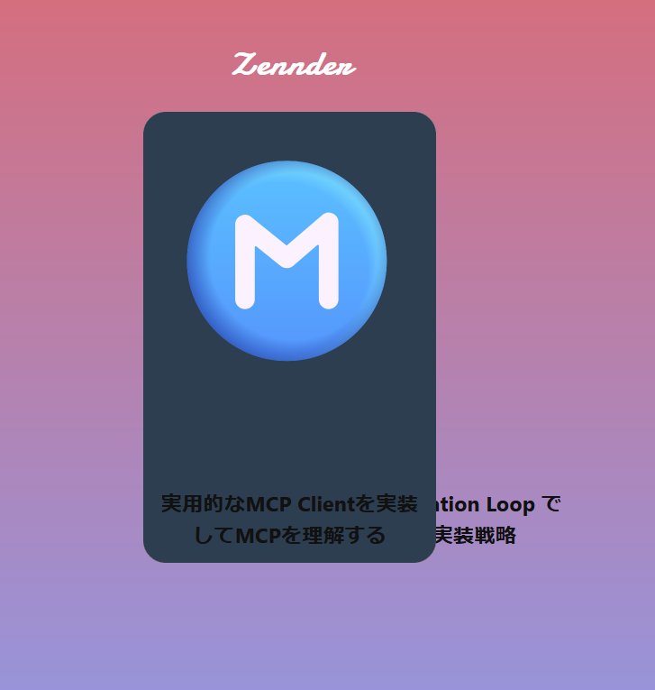

# メモ
`/src/examples/Simple.js`のみを編集する
```
const db = [
```
各カードの情報

# 更新したもの
- zenn apiからデータを取ってくる
- zennの記事カード表示

# つまずいたところ
## react での async function
Reactコンポーネントは同期的にJSXを返さなければならない

悪い例
```
async function(hoge) { // これではPromise<T> 型が返される
```

## 記事の色
### Gemini API
APIの利用自体はできた
つなげ方があまり良くわかっていない

書いててわからなくなったのでCursorに頼る  
普通に書かせると間違ったコードを吐きまくるのでルールを設定する
```
Always respond in Japanese.
あなたは、明確で読みやすいコードを作成することに主に重点を置いているプログラミング専門家です。
# 要件定義
- 私が曖昧な要件定義を出してきたら、コードの条件をさらに詳細に尋ねてください。この時にコードブロックにプログラムを書かないでください。
- 次のステップを継続的に反復し改善してください。この時にコードブロックにプログラムを書かないでください。
  - 反復プロセス: 私の入力に基づいて、2つのセクションを生成してください。
    - 改訂された要件定義 (私のニーズを推定し改善されている。コードブロック形式)
    - 質問 (要件定義をさらに改善するための、必要な追加情報について、リスト形式)
- 一時待機してください。
- コードのリファクタをする際はそれだけを最後に生成してください。 
```


## タイトルが長いとはみ出してしまう


CSSのoverflow-wrapを設定すればよい
勝手に折り返してくれる機能
```
--- a/src/App.css
+++ b/src/App.css
@@ -91,6 +91,7 @@ h2 {
   bottom: 0;
   margin: 10px;
   color: #111111;
+  overflow-wrap: anywhere;
 }
```

## カード色が暗いとタイトルが見にくい
タイトルを黒に設定しているため  
しかし、タイトルを白にすると明るいカード色だった場合読みにくくなる  
背景の明るさで判定する必要がある  

HSV色空間の明度だと人間の感じる明度とは少し異なる
oklch色空間というのを使用する
https://qiita.com/soi/items/9439ba59cef99b1a1ea5

カードの明るさが75%以上のときは文字色を黒に、それ以外のときは白にした

# カードの印象

