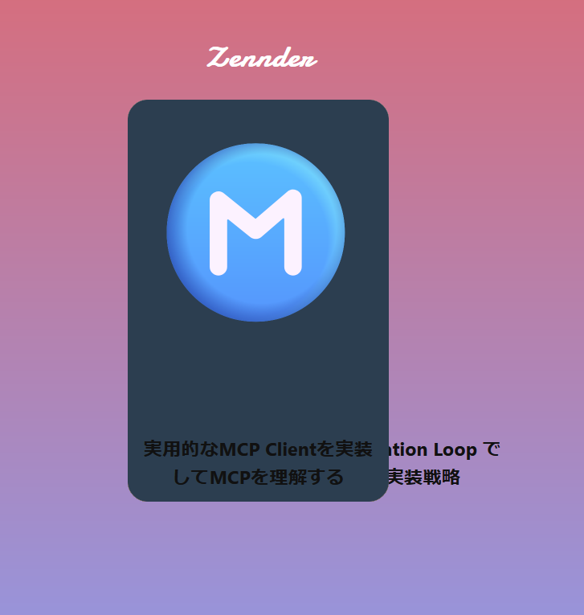

# Zennder
Zenn trend with Tinder

# 各カードの情報
- zenn apiからデータを取ってくる
  - タイトル
  - 絵文字
  - URL
- Geminiに記事の内容で受ける印象から色を生成してもらい、カードの色とする

# 記事の印象色
## Geminiに記事を読んでもらってカードの色を変える

GeminiAIに投げたプロンプト
```
I will send you article URLs, separated by newlines. Please read each article and respond with the impression you get from it, expressed as a color in RGB. Return only the 6-digit hexadecimal color code as plain text (e.g., #FF5733). When deciding on the color, consider the emotional tone or atmosphere of the article. Here are some guidelines for interpreting the tone into color:Articles that feel passionate, urgent, or give a sense of warning → more red elements. Articles focused on cutting-edge technology or data-driven analysis → more blue elements. Articles that feel cheerful, energetic, or written for beginners → more yellow elements. Articles with a calm, relaxing, or thoughtful tone → more green elements. Try to reflect the overall vibe of the article in the balance of RGB colors you choose.
```
### 翻訳
ウチがあんたに記事のURLを送るから、各記事を読んで、それぞれから感じた印象を「RGBの色」で表現してや〜。
結果は 6桁の16進数のカラーコード（例：#FF5733）だけ を、プレーンなテキストで返してな。  

色を決めるときは、記事の「感情的なトーン」や「雰囲気」を考慮して、以下のガイドラインを参考にしてな：

- 情熱的、緊急性がある、警告的な記事 → 赤成分を多めに
- 最先端技術やデータ分析中心の記事 → 青成分を多めに
- 明るくて元気、初心者向けのノリの記事 → 黄成分を多めに
- 落ち着いていて、リラックスできる、あるいは思慮深い記事 → 緑成分を多めに

記事全体の雰囲気に合うように、RGBのバランスで表現してな！


## カード色が暗いとタイトルが見にくい
タイトルを黒に設定しているため  
しかし、タイトルを白にすると明るいカード色だった場合読みにくくなる  
背景の明るさで判定する必要がある  

HSV色空間の明度だと人間の感じる明度とは少し異なる
oklch色空間というのを使用する
https://qiita.com/soi/items/9439ba59cef99b1a1ea5

カードの明るさが75%以上のときは文字色を黒に、それ以外のときは白にした


# つまずいたところ
## react での async function
Reactコンポーネントは同期的にJSXを返さなければならない

悪い例
```
async function(hoge) { // これではPromise<T> 型が返される
```

## タイトルが長いとはみ出してしまう


CSSのoverflow-wrapを設定すればよい
勝手に折り返してくれる機能
```
--- a/src/App.css
+++ b/src/App.css
@@ -91,6 +91,7 @@ h2 {
   bottom: 0;
   margin: 10px;
   color: #111111;
+  overflow-wrap: anywhere;
 }
```